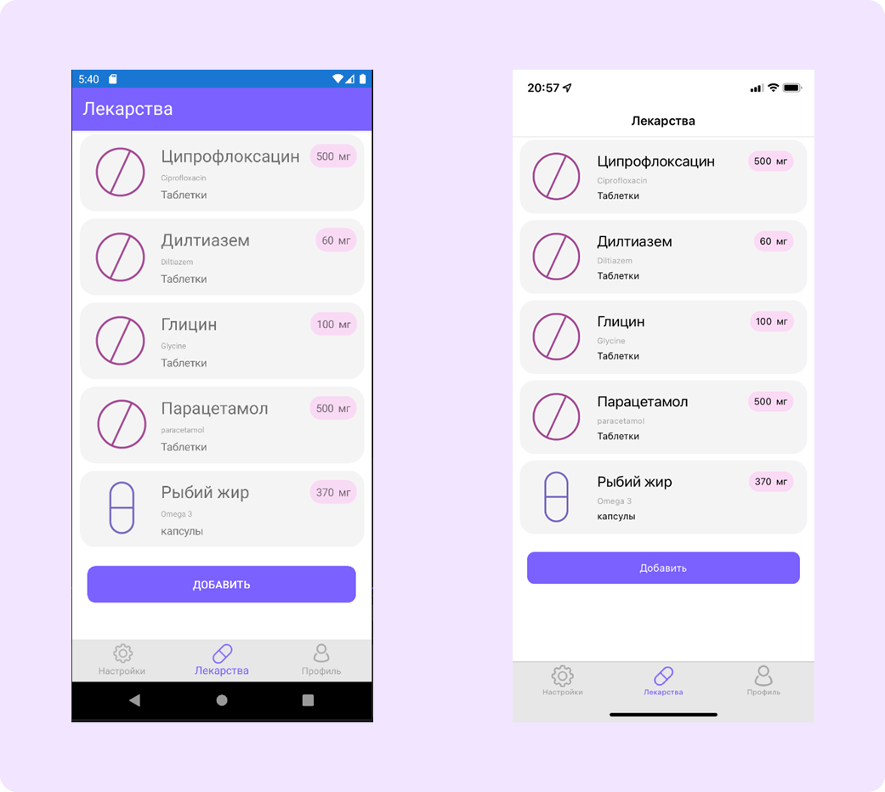

 

<h2>Pillsmaster - iOS and Android medicine traking app</h2>

Get notifications about taking medications and keep track of their amount.

 

 
 

</img>
 
 

 

## Major features

- Recieve notifications on any device
- Track medicine amount
- Save your medicine info to reuse it later
