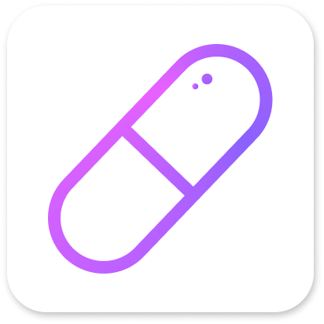

 

<h2>Pillsmaster - мобильное приложениt iOS и Android для отслеживания приема лекарственных средств</h2>

Получайте уведомления и следите за количесвом ваших лекрств.

 

 
 

</img>
 
 

 

## Основные функции

- Получайте уведомления на любых устройствах
- Отслеживайте количество лекарств
- Сохраняйте информацию о приемах для использования ее в будущем

## Ссылки
- <a href = "./README.md">Readme (EN)</a>
